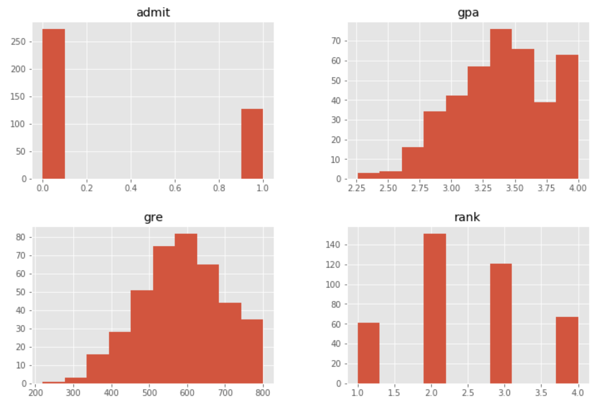
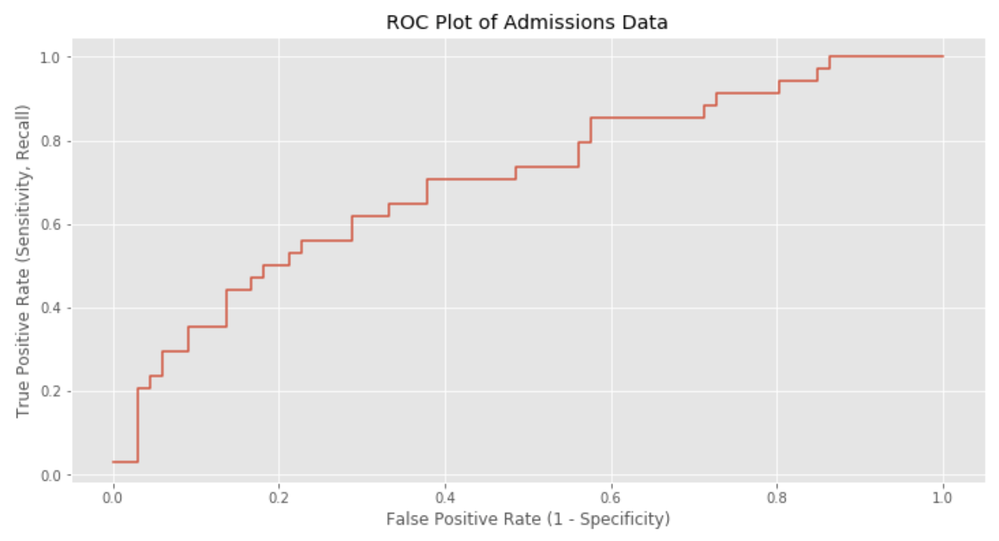

# Logistic Regression

### Part 1: Data Exploration: Graduate School Admissions

The data we will be using is admission data on Grad school acceptances.

* `admit`: whether or not the applicant was admitted to grad. school
* `gpa`: undergraduate GPA
* `gre`: score of GRE test
* `rank`: prestige of undergraduate school (1 is highest prestige, ala Harvard)

We will use the GPA, GRE, and rank of the applicants to try to predict whether or not they will be accepted into graduate school.

Before we get to predictions, we should do some data exploration.

1. Load in the dataset into pandas: `data/grad.csv`.

2. Use the pandas `describe` method to get some preliminary summary statistics on the data. In particular look at the mean values of the features.

3. Use the pandas `crosstab` method to see how many applicants from each rank of school were accepted. You should get a dataframe that looks like this:

    ```
    rank    1   2   3   4
    admit
    0      28  ..  ..  ..
    1      33  ..  ..  ..
    ```

    Make a bar plot of the percent of applicants from each rank who were accepted.


4. What does the distribution of the GPA and GRE scores look like? Do the distributions differ much?



### Part 2: Predicting Graduate School Admissions

Now we're ready to try to fit our data with Logistic Regression.

Look at sklearn's [LogisticRegression](http://scikit-learn.org/stable/modules/generated/sklearn.linear_model.LogisticRegression.html) documentation.

1. Use sklearn's [KFold cross validation](http://scikit-learn.org/stable/modules/generated/sklearn.model_selection.KFold.html) and [LogisticRegression](http://scikit-learn.org/stable/modules/generated/sklearn.linear_model.LogisticRegression.html) to calculate the average accuracy, precision and recall.

    Hint: Use sklearn's implementation of these scores in [sklearn.metrics](http://scikit-learn.org/stable/modules/classes.html#module-sklearn.metrics).

4. The `rank` column is ordinal where we assume an equal change between ranking levels, but we could also consider it to be more generally categorical. Use panda's [get_dummies](http://pandas.pydata.org/pandas-docs/stable/generated/pandas.core.reshape.get_dummies.html) to binarize the column.

5. Compute the same metrics as above. Does it do better or worse with the rank column binarized?

    From now on, use the version of the feature matrix that performed the best.

6. Make a plot of the ROC curve (See notes on ROC curve below).



7. Is it possible to pick a threshold where TPR > 60% and FPR < 40%? What is the threshold?

8. Say we are using this as a first step in the application process. We want to weed out clearly unqualified candidates, but not reject too many candidates. What might be a good choice of threshold?

    There isn't a single correct answer, so explain your choice!

### Part 3: ROC Curves

One of the best ways to evaluate how a classifier performs is an ROC curve. (http://en.wikipedia.org/wiki/Receiver_operating_characteristic)

Look at the documentation for [scikit-learns ROC curve function](http://scikit-learn.org/stable/modules/generated/sklearn.metrics.roc_curve.html) and its [user guide](https://scikit-learn.org/stable/modules/model_evaluation.html#roc-metrics).


To understand what is actually happening with an ROC curve, we can create one ourselves.  Here is pseudocode to plot it.

The `probabilities` are values in (0,1) returned from Logistic Regression. The standard default threshold is 0.5 where
0-0.5 values are interpreted as the negative class and 0.5-1 values are predicted as the positive class.

The `labels` are the true values.

```
function ROC_curve(probabilities, labels):
    Create a list of 50 thresholds, evenly spaced between 0 and 1
    For every threshold:
        Set everything above the threshold to the positive class
        Calculate the True Positive Rate (aka sensitivity or recall)
        Calculate the False Positive Rate (1 - specificity)
    Return three lists: TPRs, FPRs, thresholds
```

You're going to be implementing the `roc_curve` function.

Here's some example code that you should be able to use to plot the ROC curve with your function. This uses a fake dataset.

```python
from sklearn.datasets import make_classification
from sklearn.linear_model import LogisticRegression
import matplotlib.pyplot as plt
from sklearn.model_selection import train_test_split
from src.roc_curve import roc_curve

X, y = make_classification(n_features=2, n_redundant=0, n_informative=2,
                           n_clusters_per_class=2, n_samples=1000)
X_train, X_test, y_train, y_test = train_test_split(X, y)

model = LogisticRegression()
model.fit(X_train, y_train)
probabilities = model.predict_proba(X_test)[:, 1]

tpr, fpr, thresholds = roc_curve(probabilities, y_test)

plt.plot(fpr, tpr)
plt.xlabel("False Positive Rate (1 - Specificity)")
plt.ylabel("True Positive Rate (Sensitivity, Recall)")
plt.title("ROC plot of fake data")
plt.show()
```

1. Write an ROC curve function to compute the above in `src/roc_curve.py`.

    It should take as input the predicted probabilities and the true labels.

2. Run the above code to verify that it's working correctly. You can also validate your correctness against [scikit-learns built-in function](http://scikit-learn.org/stable/modules/generated/sklearn.metrics.roc_curve.html).

3. Let's see how the roc curve looks on a real dataset. We're going to use the FICO Loan dataset. We want to predict whether or not you get approved for a loan of 12% interest rate given the FICO Score, Loan Length and Loan Amount. Here's the code to load the data:

    ```python
    import pandas as pd
    df = pd.read_csv('data/loanf.csv')
    y = (df['Interest.Rate'] <= 12).values
    X = df[['FICO.Score', 'Loan.Length', 'Loan.Amount']].values
    ```

    Make sure to split your data into training and testing using sklearn's [train_test_split()](https://scikit-learn.org/0.16/modules/generated/sklearn.cross_validation.train_test_split.html).
